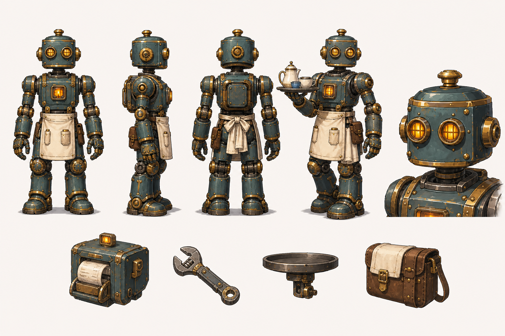
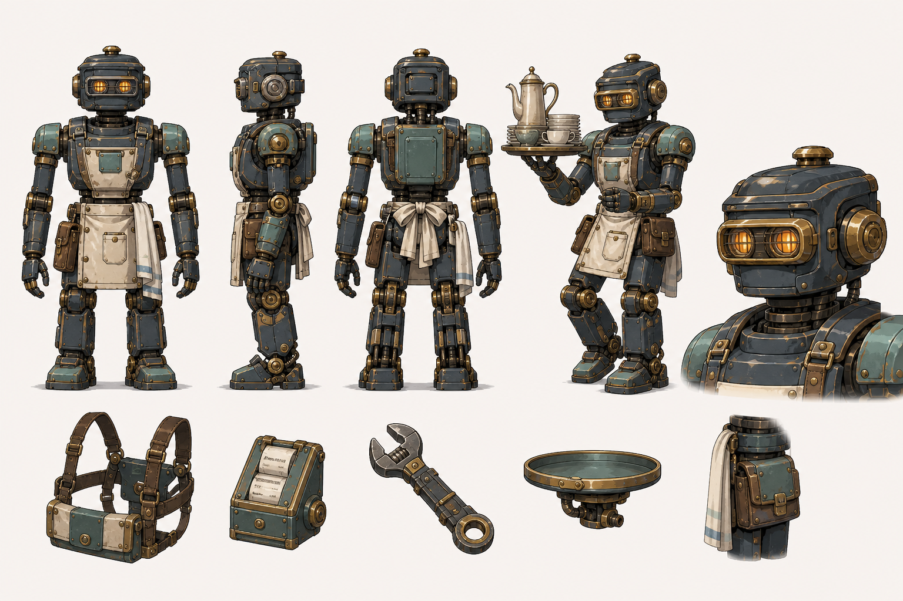
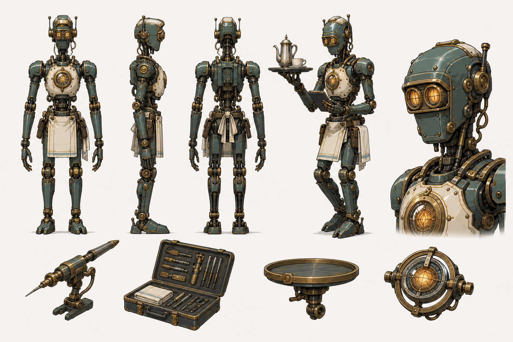

# 奥托美术概念与外包交接说明 v0.1

更新日期：2026-08-24  
状态：三套概念方向已完成，最终方向待确认  
角色内容 ID：character.otto  
原军用编号：OT-08

关联文档：

- [飞艇餐厅美术需求确认清单 v0.1](./飞艇餐厅美术需求确认清单-v0.1.md)
- [飞艇餐厅像素视觉规范 v0.1](./飞艇餐厅像素视觉规范-v0.1.md)
- [飞艇餐厅美术制作待办清单 v0.1](./飞艇餐厅美术制作待办清单-v0.1.md)

## 1. 角色定位

奥托是一台从战场退役的魔道物流/送餐机器人，现负责餐厅点单提交、取餐、上菜、结账、清桌、采购辅助、物资搬运和设备维修。它拥有完整语言与判断能力，但不需要变成人类，也不是儿童机器人或吉祥物。

## 2. 不可改条件

- 必须一眼可辨为完整机械体，不得出现人类皮肤、真人头发或真人面孔。
- 使用成年人比例，不得画成小男孩、儿童、Q 版玩具或穿机器人服的人类。
- 保留退役军用物流机械的结构依据，但不得携带武器或采用攻击姿态。
- 主要材质为蓝灰钢、旧黄铜、青绿色珐琅、奶油色服务护板和暖橙光学/状态灯。
- 情绪通过光学镜片、遮光片、头部倾角、面板/格栅和状态灯表达，不使用人类眉眼嘴差分。
- 服务托盘、订单模块、采购附件和维修工具必须是可拆分的独立部件。
- 立绘、像素角色和头像必须保持相同头部轮廓、胸口结构、主色和关节识别点。

## 3. 三套概念方向

### 3.1 A：港口服务型

- 优势：最亲和，餐厅服务身份最清楚，和普通顾客同框时压迫感最低。
- 特征：圆角方形头部、双圆形光学镜片、较宽稳定的手脚、明显围裙式服务护板。
- 风险：退役军用与远行经历较弱，容易成为通用餐厅机器人。
- 适合继承：头部亲和度、暖橙眼灯、服务护板、托盘与订单模块。

### 3.2 B：退役军用物流型

- 优势：最贴合退役军用物流机器人背景，承重、搬运和可靠感强。
- 特征：防护式光学窗、加强肩甲、活塞辅助关节、旧军用面板与民用餐厅改装并存。
- 风险：如果继续加厚或降低亮度，可能显得过于战斗化或沉重。
- 适合继承：主体骨架、肩部结构、腿部承重、旧面板覆盖关系和维修附件。

### 3.3 C：魔导精密型

- 优势：语言、判断、路线协调和维修能力最强，魔导科技特征明确。
- 特征：修长成人比例、精密长指、胸部魔导核心、传感器与校准结构。
- 风险：过度修长会削弱搬运可信度，也可能与温暖餐厅气质拉开距离。
- 适合继承：机械手、维修工具、胸部核心、传感器和精密关节细节。

## 4. 推荐合并方向

建议以 B 的承重骨架和退役物流结构为主体，采用 A 的头部亲和度与服务护板，并吸收 C 的机械手、维修附件及低亮度胸部核心。

最终轮廓应满足：

- 远看是稳重可靠的成年机械服务员。
- 中距离能读出旧军用物流骨架经过餐厅民用改装。
- 近看能发现精密传感器、维修接口和少量使用痕迹。
- 与白夜城同框时高度相近或略高，但不宽大到压住主角。

## 5. 表情与性格表现

| 情绪 | 光学组件 | 头部/身体 | 状态灯 |
|---|---|---|---|
| 平静 | 正常圆形光圈 | 头部水平、肩部放松 | 稳定低亮暖橙 |
| 爽朗开心 | 光圈略放大、上缘抬起 | 轻微前倾或侧倾 | 短促柔和双闪 |
| 认真 | 光圈缩小聚焦 | 头部回正、胸部稳定 | 稳定中亮 |
| 困惑 | 两侧光圈轻微不对称 | 头部倾斜 | 慢速交替闪烁 |
| 担忧 | 光圈收窄、亮度降低 | 肩部略收、动作放缓 | 低亮缓慢脉冲 |
| 小得意 | 一侧遮光片略压低 | 头部小幅抬起 | 快速单闪后恢复 |

## 6. 必备附件

- 服务托盘与手腕/掌部连接件。
- 一桌一提交的订单记录与提交模块。
- 账夹、零钱或收款模块。
- 采购货单、工具袋或小车连接装置。
- 常规扳手、精密维修探针和折叠工具箱。
- 餐盘、餐点、运输箱等通用携带挂点。

附件不能永久焊在身体上；不同任务通过挂点切换，避免为每个职业重画整套机体。

## 7. 动作生产要求

首批至少覆盖：idle、walk、talk、listen、点单、提交订单、取餐、托盘待机、托盘行走、上菜、结账、清桌、搬运、补给餐盘、站立维修、低位维修、候梯、进出人员电梯。

- 行走必须体现机械重量，但不能拖沓。
- 托盘动作需要稳定，不用夸张杂技姿势。
- 维修动作应显示精确与熟练，不采用攻击动作的节奏。
- 左右镜像时，编号牌、旧损伤、接口和工具位置需要独立处理。

## 8. 外包交付物

1. 角色最终正面、侧面、背面及三分之四视图。
2. 头部结构拆解、光学组件和六种表情规则。
3. 机体骨架、外壳、状态灯及可拆附件分层图。
4. 与白夜城、普通顾客、餐桌、人员电梯的比例对照。
5. 1024×1024 半身立绘母版和 256×256 头像裁切检查。
6. 48×64 普通帧或经确认后的 64×80 特殊帧像素测试。
7. 正式透明 PNG、分层源文件、色板、锚点和挂点说明。

## 9. AI 续作提示词骨架

奥托 OT-08，是从战场退役、现为飞艇餐厅服务员和维修助手的魔道物流机器人。成年人比例完整机械体，禁止人类皮肤、真人头发、真人面孔、儿童或玩具比例。使用蓝灰钢骨架、旧黄铜关节、青绿色珐琅外壳、奶油色服务护板、暖橙光学组件。以退役物流承重骨架为主体，加入亲和的餐厅民用改装和精密维修结构。情绪由光学镜片、头部倾角、面板和状态灯表达。保持头部轮廓、胸口结构、主色、关节和附件挂点一致。不要武器、战斗姿势、赛博人类、少年机器人、Q 版吉祥物、重度锈蚀或暗黑工业风。

每次续作还需附上已选定的最终设定图作为身份参考，并明确“只改变动作、角度或附件，不重新设计角色”。

## 10. 当前待确认

- 最终以 A、B、C 中哪一套为主体，或采用第 4 节推荐合并方向。
- 头部使用开放式双圆镜片还是 B 型防护光学窗。
- 胸部魔导核心是否外露，以及常态亮度。
- 机体是否保留一处可见旧军用编号牌或旧损伤。
