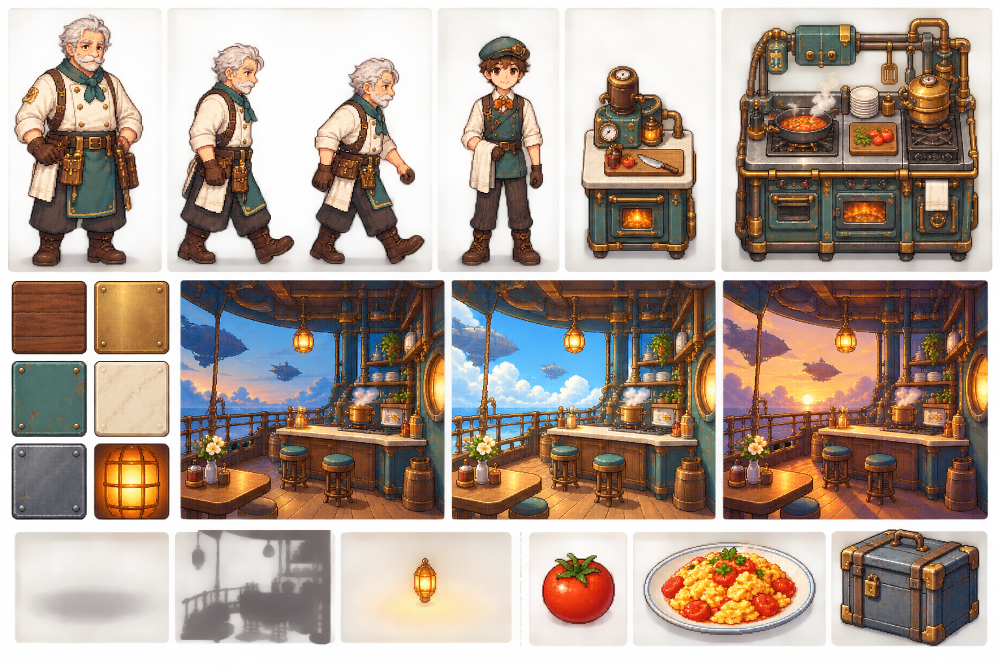
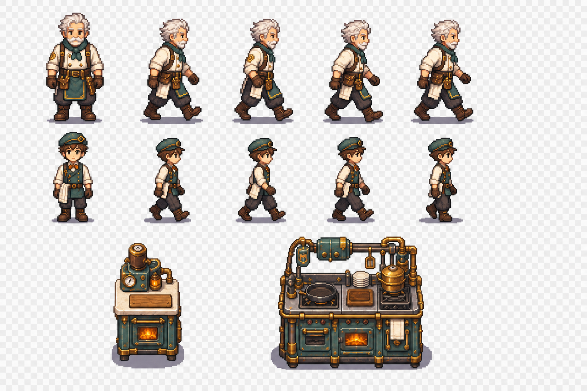
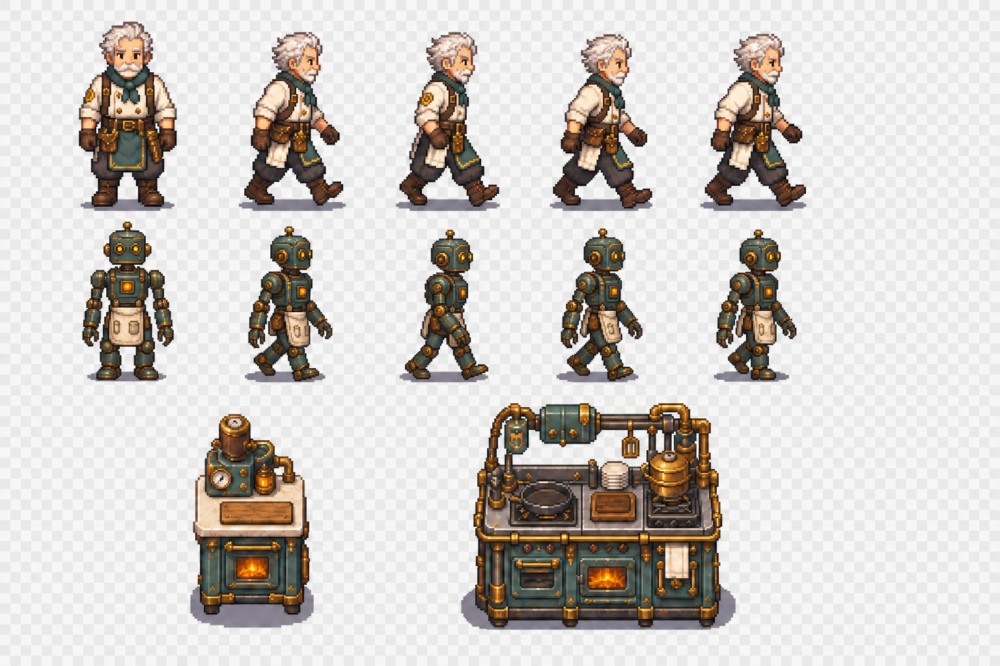

# 飞艇餐厅像素视觉规范 v0.1

更新日期：2026-08-24  
状态：书面规则已整理，视觉样张待制作与验收  
适用范围：游戏场景、角色、可摆放建筑、食物与运输物、像素特效；矢量 UI 仅复用材质与色彩语言

关联文档：

- [飞艇餐厅美术需求确认清单 v0.1](./飞艇餐厅美术需求确认清单-v0.1.md)
- [飞艇餐厅美术资源表 v0.1](./飞艇餐厅美术资源表-v0.1.md)
- [飞艇餐厅美术制作待办清单 v0.1](./飞艇餐厅美术制作待办清单-v0.1.md)
- [奥托美术概念与外包交接说明 v0.1](./奥托美术概念与外包交接说明-v0.1.md)

## 1. 视觉目标

游戏采用二次元人物设计、蒸汽朋克材质语言和 2D 正视/轻俯视像素场景。画面重点是温暖、可读、适合长时间停留的桌面伴宠氛围，不追求肮脏、压抑或高噪点的工业感。

统一原则：

- 世界结构保持现实机械逻辑，造型可以浪漫化，但不使用魔法式悬浮零件。
- 角色、设备和食物在紧凑窗口中必须一眼可辨，细节服从轮廓与功能。
- 黎明、正午、傍晚由统一的环境光、阴影和局部发光表现，基础素材保持中性色。
- 所有素材先通过原始像素尺寸检查，再进行整数倍缩放检查。

## 2. 坐标、网格与视角

### 2.1 逻辑网格

- 场景使用 64×64 px 逻辑格。
- 建筑占地使用 1×1、2×1、2×2、3×2 等整数格描述。
- 占地只表达摆放范围和交互定位，不承担角色物理阻挡；本项目是 2D 平面游戏，角色可以从桌椅和普通设备前后穿行。
- 角色脚点、建筑落地点、运输物中心点必须落在统一锚点体系中，不按图片透明边界计算位置。

### 2.2 视角

- 主体采用正视图或轻俯视正交视图，不使用强透视。
- 同类建筑必须共享相同俯视角和地面接触角度。
- 角色不制作完整四方向套图：以侧向移动和正/侧向工作动作为主。
- 飞艇、地面平台和交换站的结构层级以正视可读为优先。

### 2.3 基础尺寸

| 对象 | 原始画布/帧建议 | 备注 |
|---|---:|---|
| 普通角色 | 48×64 px | 脚点固定，帽子等不应改变脚点 |
| 特殊角色 | 最大 64×80 px | 白夜城等可使用，不得靠缩放破坏统一身高 |
| 普通物品图标 | 64×64 px | 同时检查 32×32 px 可读性 |
| 小状态图标 | 24×24 px | 订单、状态角标等 |
| 菜单菜品图 | 512×512 px | 与场景盘装图、库存图标分开制作 |
| 1×1 建筑底板 | 64×64 px | 图像可越界，占地不可隐式扩大 |

## 3. 轮廓与像素形状

### 3.1 角色

- 外轮廓通常为 1 px。
- 背光侧或最暗侧允许局部使用 2 px，不可整圈加粗。
- 禁止纯黑轮廓；使用随材质变化的深棕、深蓝灰或深紫灰。
- 面部优先保证发型、胡须、眉眼和姿态可辨，不堆叠微小五官噪点。

### 3.2 建筑与设备

- 外轮廓通常为 2 px，内部结构线为 1 px。
- 可交互部位通过形状、亮度和局部暖色强调，不依赖文字标签。
- 铜管、铆钉和齿轮只用于解释结构或强调功能，不均匀铺满表面。

### 3.3 食物与小物件

- 优先使用大色块区分主食材，再用少量高光表现湿润、油脂或陶瓷质感。
- 同一物品在库存图标、运输容器和场景摆盘中保持主色与轮廓特征一致。
- 半成品必须从形状上表达步骤差异，不能只靠色相变化。

## 4. 材质与基础色板

场景与建筑共享约 32～40 个核心颜色；角色可在此基础上增加少量服装和肤色强调色。UI 与特效使用独立扩展色板，但不得破坏整体冷暖关系。

### 4.1 核心材质

| 材质 | 主色倾向 | 暗部倾向 | 高光倾向 | 使用位置 |
|---|---|---|---|---|
| 胡桃木 | 暖棕红 | 深紫棕 | 蜂蜜棕 | 桌椅、橱柜、面板 |
| 黄铜 | 暖金棕 | 橄榄深棕 | 淡金黄 | 管线、包边、机械件 |
| 青绿色珐琅 | 低饱和蓝绿 | 深蓝绿 | 灰青白 | 灶台、设备外壳、标识 |
| 奶油色台面 | 暖灰白 | 米灰 | 柔和象牙白 | 工作台、装盘台 |
| 蓝灰钢 | 冷蓝灰 | 深靛灰 | 浅钢蓝 | 飞艇骨架、轨道、货梯 |
| 橙色灯光 | 琥珀橙 | 红棕 | 淡黄白 | 窗灯、炉火、提示灯 |

### 4.2 色彩限制

- 大面积表面保持低至中饱和度，把高饱和色留给食物、角色重点和交互反馈。
- 相邻功能设备除了色彩，还必须依靠轮廓、顶部结构或操作面区分。
- 烟尘、锈迹和油污只作轻度点缀，不能让休闲餐厅显得脏乱。
- 白色不使用纯白，黑色不使用纯黑，保留环境光染色空间。

## 5. 三时段光照

所有基础素材按正午中性光绘制，黎明和傍晚由场景色调层、独立阴影、窗灯/炉火发光层组合完成，不为每个时段重复制作整套建筑图。

| 时段 | 环境光 | 主光方向 | 阴影色 | 局部发光 |
|---|---|---|---|---|
| 黎明 | 冷蓝、低对比 | 左侧低角度暖光 | 蓝紫灰 | 窗灯和炉火仍明显 |
| 正午 | 中性、清晰 | 上方 | 冷中性灰 | 仅保留功能性亮点 |
| 傍晚 | 橙金、暖高光 | 右侧低角度 | 紫蓝灰 | 灯具、窗户和炉火增强 |

切换要求：

- 氛围变化允许平滑过渡，不突然替换整张背景。
- 不使用复杂实时法线光照作为基础依赖。
- 信息提示、任务状态和可交互轮廓不被色调层压暗到不可读。
- 编辑模式使用稳定的中性光，暂停时间变化，保证颜色和占地判断一致。

## 6. 阴影与发光层

### 6.1 角色和小物件

- 使用独立椭圆或近似椭圆的接地阴影。
- 阴影不烘焙进角色帧，避免移动和时段变化时重影。
- 接地处最深，边缘使用像素化分级，不使用高模糊半透明边。

### 6.2 建筑

- 使用独立阴影遮罩，根据时段改变偏移和色调。
- 黎明阴影向右，正午短而靠近底部，傍晚阴影向左。
- 常规可见偏移控制在约 6～12 px；大型结构可按尺寸等比例调整，但不能遮挡关键交互点。

### 6.3 发光

- 灯具、炉火、提示灯的发光层独立导出。
- 发光负责氛围，不替代状态反馈；设备是否可用仍需形状或图标表达。
- 同屏发光数量受控，避免所有黄铜边缘都发亮。

## 7. 动画规范

| 动画类型 | 建议播放速度 | 设计要求 |
|---|---:|---|
| idle / talk | 6～8 FPS | 小幅呼吸、手势和表情，不持续大幅摆动 |
| walk | 10 FPS | 脚点稳定，携带物层与人物同步 |
| work / repair | 10～12 FPS | 动作节奏明确，接触点保持稳定 |
| 机械设备 | 8 FPS | 齿轮、活塞和指示灯按功能循环 |
| 短特效 | 10～12 FPS | 蒸汽、火花、完成反馈快速收束 |
| 旗帜 / 风铃 | 6 FPS | 低频环境循环，避免抢夺注意力 |

### 7.1 循环和节奏

- 待机循环必须能长时间观看，不出现明显停顿点。
- 工作动作的关键帧要对应实际交互点，例如刀落在砧板、锅铲进入锅内。
- 任务完成广播由逻辑系统触发，动画只表现结果，不自行决定业务完成时机。

### 7.2 左右镜像

- 默认制作一个侧向动画并由运行时水平翻转。
- 文字、徽章、单侧义肢、工具接口等不可镜像元素必须拆为独立层或提供方向变体。
- 携带物和托盘作为独立层，通过命名挂点定位。
- 对话立绘和菜单插图永不使用运行时镜像。

## 8. 图层、锚点与导出

### 8.1 推荐图层

场景对象按需要拆分为：

1. shadow：接地或投射阴影。
2. base：主体中性光贴图。
3. moving：齿轮、门、抽屉、货梯平台等运动部件。
4. prop：携带物、食材、餐盘等可替换内容。
5. emissive：灯光、炉火、状态灯。
6. foreground：栏杆、蒸汽等需要遮挡角色的前景。

### 8.2 必备锚点

- origin：对象逻辑原点。
- ground：与地面接触点。
- interaction：角色执行操作时的目标点。
- carry：运输物或餐盘的挂点。
- seat：桌椅就座点，仅座位对象需要。
- output：设备成品或半成品出现点。

同一类型对象的锚点名称和语义必须一致；图片换样式时不得改变业务对象 ID 或存档结构。

### 8.3 缩放与采样

- 原始像素素材以 1× 保存。
- 游戏中优先使用 1×、2×、3× 整数倍显示。
- 纹理采样统一使用 NEAREST，禁止双线性过滤。
- 非整数窗口缩放时，先保持场景逻辑比例，再通过像素对齐策略减少抖动；不可单独拉伸角色或建筑。

## 9. P0A-001 视觉样张板

书面规范不能替代视觉验收。P0A-001 必须制作一张统一样张板，至少包含：

1. 白夜城普通站立帧与侧向行走关键帧。
2. 奥托普通站立帧：退役魔道送餐机器人、成年人比例人形机械体，用于验证机械角色与老年人类主角的轮廓和材质差异。
3. 一个 1×1 小设备和一个 2×2 主要设备。
4. 胡桃木、黄铜、青绿色珐琅、奶油色台面、蓝灰钢、橙色灯光六类材质色块。
5. 同一小场景的黎明、正午、傍晚三种状态。
6. 角色椭圆阴影、建筑阴影遮罩和独立发光层示意。
7. 同一素材在 1×、2×、3× 下的最近邻缩放对照。
8. 一个食材图标、一个盘装菜和一个运输容器，用于检查跨类别一致性。

### 9.1 第一版风格锚点

初步结论：

- 已通过方向检查：温暖休闲氛围、老年男性白夜城、胡桃木/黄铜/青绿色珐琅等核心材质、三个时段的冷暖差异、真实番茄与番茄炒蛋。
- 尚未通过接入检查：角色仍是高精度概念像素比例，并非严格 48×64 帧；设备未按 64 像素逻辑格导出；没有真实的 1×/2×/3× 最近邻对照；其中奥托被错误绘制成人类青年，该形象已废弃。
- 本图只作为后续精灵与设备素材的风格锚点，不直接进入运行时资源包。

### 9.2 第一版精灵验证参考（奥托部分已废弃）

初步结论：

- 白夜城形象可继续作为比例参考；奥托被错误绘制成人类青年，整行人类精灵均作废，不得作为后续角色设计依据。
- 白夜城侧向行走的脚点和整体高度较稳定，可作为正式动作拆帧的造型参考；奥托部分不继承。
- 当前参考图是 1536×1024 的 Format24bppRgb 图片，棋盘格已烘焙进背景，并不具备 Alpha 通道；正式素材必须重新输出真实透明背景，再切分为固定画布的独立帧，设备也必须重新约束到 64 像素逻辑底板。
- 该图不直接进入运行时资源包，不把生成图中的帧间距或设备尺寸视为最终数值。

### 9.3 奥托机器人纠错样张

纠错结论：

- 奥托现为同一台退役魔道送餐机器人 OT-08：成年人比例人形机械体，蓝灰钢骨架、黄铜分段关节、青绿色珐琅外壳、奶油色服务围挡和暖橙光学/状态组件。
- 正面待机与四帧侧向行走保持一致身份，没有人类皮肤、真人头发或儿童体型；白夜城和设备部分继续沿用原参考。
- 此图确认“机器人而非人类”的方向，但头部结构、军用遗留特征、餐厅改装细节和正式 48×64/64×80 逻辑画布仍需在奥托专属设定稿中冻结。
- 图片仍为 Format24bppRgb，棋盘格属于烘焙背景，因此只能作为造型参考，不直接进入运行时资源包。

## 10. P0A-001 验收条件

满足以下条件后，P0A-001 才能由“视觉样张待验收”改为“已完成”：

- 普通角色、特殊角色和建筑在 64 像素逻辑网格中比例协调。
- 六类核心材质无需文字即可基本区分。
- 三个时段能明显改变氛围，但不改变对象固有颜色和功能可读性。
- 阴影方向、接地关系和飞艇悬浮关系没有冲突。
- 1× 原图无脏像素，2×/3× 无模糊、断线或半像素抖动。
- 角色轮廓、建筑轮廓和小物件轮廓层级统一。
- 白夜城仍然明确呈现偏男性的老年主角形象。
- 样张中的表现层替换不写入业务状态，不改变角色、设备、库存或存档数据。

## 11. 当前结论

ART-009～ART-016 的书面视觉规则已经集中整理。当前尚未完成的是视觉样张板及其游戏窗口内对照验收，因此本规范为 v0.1，暂不视为最终冻结版。
