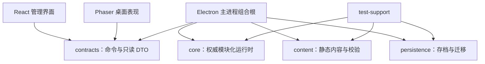
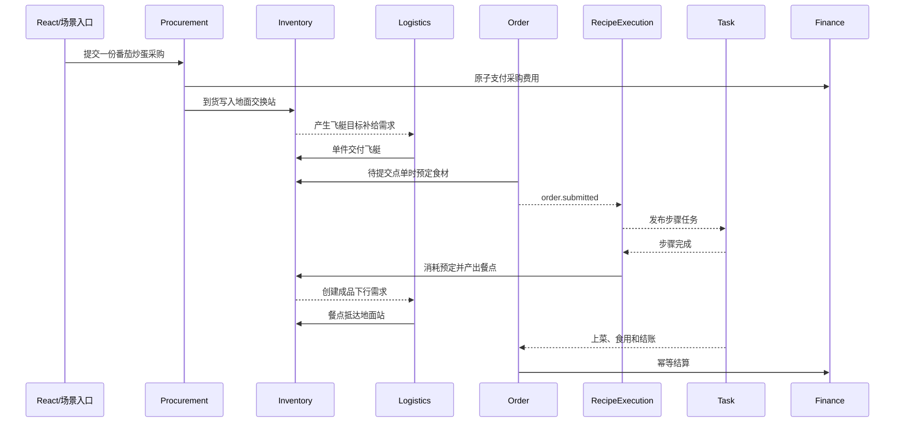

# 飞艇餐厅重构架构设计 v0.1

> 本文档由已确认需求清单推导，描述重构后的模块边界、数据所有权、依赖方向、存档边界和迁移顺序；不包含具体代码实现。

> 历史设计记录：本文保留 2026-08-17 重构启动时的问题盘点、目标状态和迁移顺序，不代表 2026-08-19 的当前实现。当前边界请以《飞艇餐厅当前技术架构 v0.1》为准；文中“当前实现”均指重构启动时的旧代码。

## 1. 文档定位

### 1.1 目标

本轮重构不是在现有类之间继续增加判断，而是先建立稳定的业务边界，使以下规则长期成立：

1. 每一份业务数据只有一个权威所有者。
2. UI、Phaser 动画和场景表现不能直接修改业务状态。
3. 模块通过命令、领域事件和只读模型协作，不读取或写入彼此的内部可变对象。
4. 在线推进、暂停、离线补算、存档恢复和不同 Tick 密度得到一致业务结果。
5. 每次迁移都保持项目可构建、可运行、可回退，不进行一次性全量重写。

### 1.2 需求依据

业务规则以 [飞艇餐厅功能模块需求确认清单 v0.1](./飞艇餐厅功能模块需求确认清单-v0.1.md) 为最高依据。本文档只负责把已确认需求转换为代码架构，不重新解释或改变玩法。

现有《飞艇餐厅升级内容分类清单 v0.1》包含已经废止的缆车容量、自动卸货、科技自动采购和飞艇存储站等旧方案，只作为历史记录，不再作为实现依据。

### 1.3 当前技术约束

- 正式客户端：Electron + Phaser + React + TypeScript。
- 权威运行时位于 Electron 主进程。
- Phaser 负责桌面世界、角色、建筑、运输和动画表现。
- React 负责仓库、食谱、员工、科技树、报表等复杂管理界面。
- 项目是单机 2D 平面桌面伴宠，不引入服务器、3D 导航或分布式事务。

## 2. 当前结构判断

### 2.1 可以保留的基础

现有 workspace 方向正确，可以继续使用：

```text
apps/desktop/             Electron 主进程、preload、Phaser 与 React
packages/contracts/       跨进程命令、事件、校验器和只读 DTO
packages/core/            平台无关的权威业务运行时
packages/content/         静态内容定义、索引和构建期校验
packages/persistence/     存档信封、迁移与原子写入
packages/test-support/    手动时钟、固定随机数与测试夹具
```

主进程权威状态、IPC 白名单、版本化存档、手动时钟和固定随机数都是重构时应保留的正确基础。

### 2.2 主要耦合风险

1. `GameRuntime` 同时承担命令去重、命令分发、时间推进、故事观察、闲聊推进、表现 Demo 和总快照拼装，新增业务会继续放大中心类。
2. `M2Simulation` 同时拥有库存、烹饪、物流、餐厅、采购、随机数、补给与升级状态，是当前最明显的跨领域聚合点。
3. `RestaurantSystem` 等早期系统使用简化的整段状态机，无法自然承载角色职位、任务优先级、订单提交点、食谱步骤图、餐盘循环和多建筑实例。
4. Phaser 渲染层的 `RestaurantServiceTaskQueue`、`RestaurantOttoServiceCoordinator`、顾客生命周期协调器和 `RestaurantNpcDirector` 仍在决定服务任务、顾客阶段和奥拓行为；窗口重建、掉帧或表现模式变化可能影响业务事实。
5. 主进程 `story-runtime.ts` 仍硬编码具体故事阶段与内容 ID，内容、流程和运行时组合没有完全分离。
6. 当前总快照把多个领域一次性拼接后广播，后续状态量扩大时会增加不必要的 IPC、渲染刷新和模块互相依赖。

## 3. 目标架构原则

### 3.1 模块化单体

游戏继续使用一个主进程权威运行时，不拆成网络服务。`packages/core` 内部按领域模块隔离；模块之间只能通过公开端口、命令、领域事件和只读查询协作。

### 3.2 单一数据所有权

- 只有所有者模块能够改变自己的状态。
- 其他模块只能提交命令或响应所有者发布的事件。
- 只读模型是派生结果，不得反向成为业务事实来源。
- 不允许在 UI、Phaser Actor、动画状态或临时协调器中保存另一份订单、任务、库存或角色业务状态。

### 3.3 命令、事件与读模型分离

- 命令表达“希望系统做什么”，允许成功或拒绝，并必须幂等。
- 领域事件表达“已经发生什么”，事件接收者不能否决已经提交的事实。
- 读模型表达“界面目前需要看到什么”，可以按窗口和功能裁剪。

### 3.4 业务先于表现

核心层根据模拟时间决定移动、加工、运输、用餐和清洗是否完成；Phaser 只按只读时间段插值和播放动画。缺少素材、窗口隐藏、低动态模式或渲染器重启不能阻塞业务。

### 3.5 稳定 ID 与显式事务

角色、任务来源、订单、单份餐点、食谱实例、步骤实例、建筑、工作位、交互点、仓储组件、物品单位、货梯、载具、路线、流水和故事节点都使用稳定 ID。

涉及多份状态的关键动作必须先完整校验，再一次提交；失败时不能留下半笔资金、半份库存或孤立引用。

### 3.6 不引入不必要复杂度

本项目不采用微服务、完整事件溯源、通用 ECS、运行时脚本语言或 3D 导航网格。领域事件用于解耦和投影，不把所有历史事件作为存档唯一来源。

## 4. 包与依赖方向



依赖限制：

1. Phaser 与 React 只能依赖 `contracts` 和纯表现资源，不能导入 `core` 业务类。
2. `core` 不能依赖 Electron、Phaser、React、DOM、文件系统或真实系统时钟。
3. `content` 输出纯数据定义和校验结果，不持有运行中状态，也不回调业务模块。
4. `persistence` 负责信封、版本、迁移和原子文件操作，不直接决定业务默认值。
5. `apps/desktop` 主进程是组合根，负责创建模块、注入内容、时钟、随机源和存档端口。

## 5. 核心运行时结构

### 5.1 Kernel

`core/kernel` 只提供所有领域共同使用的基础设施：

- `CommandBus`：命令路由、运行时校验、命令 ID 去重和结构化结果。
- `DomainEventBus`：事务提交后的同步领域事件分发。
- `SimulationClock`：游戏模拟时间、暂停、倍速和离线推进边界。
- `RealTimeClockPort`：番茄钟使用的现实时间端口。
- `IdGenerator` 与 `RandomSource`：可注入、可复现。
- `TransactionScope`：内存状态的校验、暂存、提交与回滚边界。
- `ReadModelRegistry`：按功能生成带 revision 的只读模型。

Kernel 不包含餐厅、角色、库存或剧情规则。

### 5.2 GameRuntime 的目标职责

重构后的 `GameRuntime` 只负责接收并路由命令、推进两类时钟、在事务提交后派发领域事件、更新读模型 revision，以及协调保存和读取。

它不再包含具体菜品、订单、顾客、科技或故事条件的 `switch` 业务判断。

## 6. 领域模块与数据所有权

| 模块 | 权威拥有的数据 | 明确禁止 |
|---|---|---|
| Time | 模拟时间、暂停、倍速、离线窗口、现实番茄钟 | 直接完成订单或任务 |
| Character | 角色、标签、职位、技能、天赋、雇佣、日程和在岗状态 | 保存任务队列或餐桌状态 |
| Task | 任务、来源、资格、优先级、分配、执行与中断 | 修改订单、库存或建筑内部状态 |
| SceneLayout | 2D 场景、建筑、占地、工作位、交互点、候位点和连接点 | 保存角色业务状态和库存数量 |
| Movement | 角色逻辑位置、移动计划和交互站位预订 | 决定任务业务完成、人员电梯调度或动画资源 |
| Inventory | 物品、唯一位置、分类、容量、预定、在途归属和原子转移 | 决定采购价格或食谱依赖 |
| Dishware | 清洗队列、清洗进度和餐盘补给需求 | 另存餐盘位置；位置以 Inventory 为准 |
| Order | 待提交点单、订单、订单项、价格、预定引用和结算状态 | 直接扣库存或写财务流水 |
| RecipeExecution | 游戏食谱实例、步骤 DAG、半成品、进度、设备占用和质量 | 让现实食谱参与业务计算 |
| Customer | 顾客组、等候、座位、来访阶段、选菜、用餐和离店 | 为闲聊移动顾客或直接创建厨房任务 |
| Service | 服务任务来源规则、托盘批次和桌边服务过程 | 自建角色调度；实际调度归 Task |
| Logistics | 运输需求、单件任务、货梯实例、路线、进度与耐久 | 运输角色或修改库存账本 |
| PersonnelElevator | 单人轿厢位置、乘客、候梯队列、行程进度和停靠状态 | 运输物资、读取物资货梯科技或决定角色后续任务 |
| Procurement | 采购草稿、订单、批次、来源、价格与到货快照 | 直接写库存与财务 |
| Fleet | 采购小车、采购飞艇、等级、属性、耐久、冷却与航程 | 保存航线解锁或船长技能 |
| Finance | 余额、资金预留、流水、结算批次和日结 | 决定订单或建筑是否完成 |
| Technology | 科技等级、前置与语义效果查询 | 直接修改货梯、员工或建筑 |
| Progression | 地区、航线、菜品、建筑和样式的揭示与解锁 ID | 自动赠送实体或物资 |
| Narrative | 花名册、故事、好感度、对话会话与核心成员加入 | 在专注模式生成剧情或直接改库存 |
| Notification | 玩家通知队列与聚合策略 | 成为业务流程继续的必要条件 |

### 6.1 静态内容与运行实例分离

`packages/content` 保存定义，`packages/core` 保存运行实例，例如角色定义与角色实例、建筑定义与建筑实例、游戏食谱定义与食谱执行实例、现实食谱定义与只读食谱册条目。

同一道菜必须同时具有简化游戏食谱和详细现实食谱。调味品只存在于详细现实食谱定义中，不能生成库存 ID、采购行或步骤消耗。

## 7. 跨模块协作规则

### 7.1 命令与事件

命令统一携带 `commandId`、类型、发出时间、来源、`correlationId`、载荷和可选 revision。结果统一为成功、拒绝或无变化；正常业务拒绝使用稳定原因码，不抛异常。

领域事件统一携带 `eventId`、类型、模拟发生时间、聚合 ID、`causationId`、`correlationId` 和载荷。事件接收者不能否决已提交事实，UI、音效与动画必须可去重。

### 7.2 跨模块写入

跨模块流程由应用服务或小型 Process Manager 编排，禁止模块直接获取另一模块的可变实例。关键操作先校验全部条件再一次提交；长流程保存稳定引用和业务状态，通过后续事件继续。

### 7.3 完整经营闭环示例



## 8. 读模型与表现层

逐步把单一巨型快照拆为带独立 revision 的功能读模型：桌面世界、库存、经营、采购、员工、成长、财务和布局。主进程只向订阅功能发送变化切片。

Phaser 可以保留 Sprite、动画、插值、镜头、特效、点击热区和占位资源；服务任务、顾客阶段、奥拓任务选择、业务预定和故事条件必须迁回 core。

目标状态已由 `RestaurantNpcProjector` 落地：它接收角色表现读模型，创建或复用 Actor Frame，播放移动与动作所需的表现数据，不决定业务下一步。

React 只能查询读模型、发送命令和保存页签、筛选、滚动、未提交表单等纯 UI 状态。库存、科技、订单、职位和建造预扣款不能只存在于 React state。

## 9. 时间、暂停与离线

1. 模拟时钟负责经营、角色任务、烹饪、清洗、运输、采购航程、维修和冷却。
2. 现实时间端口只负责番茄钟与应用外经过时间观测。
3. 暂停和编辑模式冻结模拟时钟，不冻结现实番茄钟。
4. 剧情对话结束前延迟进入专注模式；专注模式抑制剧情与闲聊，但经营照常并应用已确认收益效果。
5. 离线补算上限为八小时，只推进退出前已经开始且结果确定的过程；不生成新顾客、订单、采购或剧情。
6. 所有长过程保存开始时的规则和属性快照；升级只从下一个已确认业务边界生效。

## 10. 存档架构

### 10.1 顶层信封

```text
saveVersion
createdAt
updatedAt
lastObservedUtcMs
moduleStates: {
  time, character, task, sceneLayout, movement,
  inventory, dishware, order, recipeExecution,
  customer, logistics, personnelElevator,
  procurement, fleet, finance, technology,
  progression, narrative
}
```

每个模块状态包含自己的 `schemaVersion`。顶层只组织模块，不理解各模块内部字段。

### 10.2 保存内容边界

- 保存稳定业务事实、长过程进度、预定、绑定关系、属性快照和幂等键。
- 不保存可以重建的临时读模型、动画帧、缓存路径、弹窗状态和派生汇总。
- 由来源状态可完全重建的等待任务不重复保存；已经开始且具有执行进度、角色绑定或不可中断状态的任务保存必要稳定字段。
- 未识别的可选模块数据保留为孤立载荷，不能静默删除。

### 10.3 读取顺序

1. 读取正式存档；失败时验证备份。
2. 迁移顶层信封与各模块版本，不覆盖原文件。
3. 恢复静态内容注册表和稳定定义引用。
4. 恢复时间、进度、科技和场景建筑。
5. 恢复角色、库存、载具与稳定实例。
6. 恢复订单、食谱、运输、采购、任务和故事等引用实例的过程。
7. 对账资金、库存、餐盘、预定和引用不变量。
8. 重建读模型、派生任务和表现路线；不重放历史奖励与完成事件。

## 11. 目标目录建议

首版不增加新的 npm workspace，先在 `packages/core` 内建立清晰目录：

```text
packages/core/src/
  kernel/
  runtime/
  modules/
    time/
    character/
    task/
    scene-layout/
    movement/
    inventory/
    dishware/
    order/
    recipe-execution/
    customer/
    service/
    logistics/
    personnel-elevator/
    procurement/
    fleet/
    finance/
    technology/
    progression/
    narrative/
  projections/
  compatibility/
```

每个模块内部优先采用：

```text
domain.ts          实体、值对象和不变量
commands.ts        命令及处理器
events.ts          领域事件
state.ts           可保存状态与版本
read-model.ts      模块只读投影
index.ts           唯一公开出口
```

目录不是强制模板；没有足够复杂度的模块可以合并文件，但禁止其他模块绕过 `index.ts` 引用内部实现。

## 12. 旧实现迁移映射

| 当前实现 | 目标处理 |
|---|---|
| `GameRuntime.dispatch` 大型 switch | 迁为注册式 CommandBus；GameRuntime 只保留宿主职责 |
| 重构前的经营聚合对象 | 已删除；由 `GameplayRuntime` 与领域模块替代 |
| `InventorySystem` | 保留算法与测试，扩展为唯一多位置库存账本 |
| `CookingSystem` | 迁为 RecipeExecution，支持 DAG、设备工作位、半成品与厨师快照 |
| `LogisticsSystem` | 迁为运输需求、单件货梯实例与双向优先队列 |
| `ProcurementSystem` | 拆分 Procurement 与 Fleet，付款和入库通过端口协作 |
| `RestaurantSystem` | 拆分 Customer、Order、Service 与 Finance 结算 |
| `NarrativeSystem` / `StorySequenceSystem` | 收紧边界；故事定义迁入 content，运行状态留在 Narrative |
| `story-runtime.ts` 硬编码阶段 | 改为从 content 加载并校验，主进程只负责组合 |
| Phaser `RestaurantServiceTaskQueue` | 业务任务迁回 Task/Service；渲染层只保留动画队列 |
| Phaser 顾客与奥拓协调器 | 保留 Actor、移动插值与动画，移除业务决策 |
| 单一 `GameSnapshot` 广播 | 先保留兼容门面，再迁为分功能 revision 读模型 |

## 13. 分阶段重构顺序

### R0：冻结与特征测试

- 以当前测试建立行为基线。
- 为主运行时、重构前经营聚合对象和渲染层事件补充特征测试。
- 禁止在旧系统继续增加新玩法，只允许必要修复。

退出条件：`npm run check` 通过，现有 Demo 和存档样本可以重复运行。

### R1：Kernel 与兼容门面

- 建立 CommandBus、DomainEventBus、模块注册、事务边界和分片读模型接口。
- GameRuntime 对外命令与快照暂时不变，内部先转发给兼容处理器。
- 建立依赖规则测试，禁止 renderer 导入 core。

退出条件：没有玩法变化，旧 UI 与桌面表现继续工作。

### R2：内容、存档与 ID 基线

- 将角色、建筑、游戏食谱、现实食谱、科技、路线和故事定义统一纳入 content 校验。
- 建立模块化存档信封、逐模块版本和旧档导入适配器。
- 固定所有运行实例 ID 与关联规则。

退出条件：新旧存档转换等价，未知可选数据不丢失。

### R3：场景、建筑、库存与财务基础

- 迁移 SceneLayout、Inventory、Dishware、Finance。
- 实现建筑组件、分类仓储、资金预扣、餐盘守恒和编辑模式事务。
- Phaser 改为读取布局读模型，不再拥有业务预定。

退出条件：建筑移动升级、库存转移、橱柜清洗与资金守恒验收通过。

### R4：角色、任务、移动与人员电梯

- 建立统一 Character 和 Task。
- 迁移职位、日程、技能、天赋和任务分层优先级。
- 建立 2D 交互站位、移动计划和单人专用人员电梯。

退出条件：白夜城与奥拓由通用角色对象驱动，渲染器不再选择业务任务。

### R5：订单、食谱 DAG 与厨房

- 迁移 Customer、Order、RecipeExecution。
- 实现待提交点单、食材预定、订单传递点、番茄炒蛋 DAG、设备工作位、半成品、装盘与质量。
- 详细现实食谱保持纯只读内容。

退出条件：核心层可独立完成订单到已装盘餐点的确定性测试。

### R6：单件物流、服务与本地采购闭环

- 迁移 Logistics、Service、Procurement 与本地采购小车。
- 接入四台初始货梯、地面取餐、上菜、结账、清桌、洗盘和补给恢复。
- 删除 Phaser 中的服务任务与顾客业务状态。

退出条件：需求清单第 48 项 Demo 完整经营闭环全部通过。

### R7：科技、招募、内容解锁与剧情

- 接入五类基础科技、建筑与载具实例升级、普通招募、永久内容解锁。
- 迁移故事、花名册、好感度、闲聊、专注模式和餐厅管理员能力。
- 故事阶段全部数据化，移除主进程硬编码。

退出条件：升级归类无重复入口，专注、剧情、离线和存档规则通过。

### R8：清理兼容层

- 删除重构前经营聚合状态和不再使用的 renderer 业务协调器。（已完成）
- 收紧 package exports，移除旧快照字段和迁移期适配器。
- 更新 README、任务文档和旧升级清单的权威状态说明。

退出条件：没有双写状态、旧路径引用或兼容门面，全量回归和稳定性测试通过。

## 14. 验收与架构护栏

### 14.1 自动护栏

1. TypeScript 项目引用与规则测试限制跨包和跨模块内部导入。
2. 每个命令处理器测试成功、拒绝、重复命令和异常回滚。
3. 每个事件测试唯一 ID、因果 ID、顺序和重复投递幂等。
4. 手动时钟验证一次推进、分段推进、暂停恢复与存档恢复等价。
5. 固定随机源验证招募、客流和闲聊结果可复现。
6. 保存读取测试验证模块状态等价、迁移和备份回退。

### 14.2 全局不变量

- 资金不能凭空增加或减少。
- 物品与餐盘不能复制、丢失或出现两个位置。
- 同一订单只能结算一次。
- 同一任务完成事实只能广播一次。
- 工作位、交互点、仓位和资金预定必须正确释放。
- 稳定 ID 引用必须有效。
- UI 与 Phaser 不得成为业务完成的必要条件。

### 14.3 阶段提交规则

- 每个阶段只迁移明确模块，不顺手重写无关表现。
- 新旧实现不得长期双写同一业务数据；过渡期必须指定唯一权威侧。
- 每迁移一个模块，先切换命令，再切换读模型，最后删除旧写路径。
- 阶段未达到退出条件时不进入下一阶段。

## 15. 已确认架构决策

1. 首轮重构继续保留现有六个 npm workspace，不把每个领域模块拆成独立 package。领域隔离先通过 `packages/core/src/modules/*`、公开出口和依赖测试实现。

2. 重构采用 R0—R8 渐进替换，不进行一次性推倒重写。旧系统先冻结并补特征测试；每个模块按“新模块建立、命令写入切换、读模型与存档切换、旧写路径删除”的顺序迁移。过渡期间同一业务数据只能有一个权威写入侧，禁止新旧系统双写；每个阶段达到退出条件后才能继续。

3. 同一次操作需要全部成功或全部失败时，由应用服务在同步事务中协调模块；事务提交后才发布领域事件。事件用于通知、后续任务和读模型，不参与已经提交事务的回滚。跨时间流程由保存稳定状态的 Process Manager 管理，事件订阅使用稳定事件 ID 幂等重试。

4. Core 拥有角色、人员电梯和小型货梯的逻辑位置、移动计划、时间进度、到达与业务完成权；Phaser 只读取计划进行插值和动画表现。窗口隐藏、掉帧、资源缺失或渲染器重建不能阻塞业务，动画完成回调不得直接完成订单、任务、送餐或运输。

5. 窗口状态同步逐步从单一总快照迁移为带独立 revision 的功能读模型切片。DesktopWindow 默认订阅桌面世界、对话和通知，ManagementWindow 按打开面板订阅；窗口重建先读取当前切片，之后只接收变化切片。领域事件只承载瞬时提示，长期界面状态必须可由读模型完整恢复。

6. Task 不保存等待队列、优先级缓存或候选角色等临时实例；订单、食谱、桌面、餐盘、维修和运输等来源模块保存业务状态，读档后按“来源 ID＋任务类型＋业务阶段”稳定重建任务。已经开始的任务由来源模块保存执行绑定与进度、Movement 保存移动计划，再恢复任务投影；重建后重新计算优先级。

7. Inventory 使用混合模型：同质食材按物品、位置、状态和预定归属保存整数数量批次；餐盘、半成品和成品保存唯一实例。货梯接取普通食材时从数量批次原子拆出一个标准单位绑定运输，到站后可重新合并；UI 始终按物品堆叠显示，仓储容量仍按实际单位占用计算。

8. BuildingInstance 只保存身份、场景布局、样式、等级、耐久、启用状态和稳定能力组件 ID；组件描述能力和参数，不成为任意业务状态容器。库存、清洗、食谱占用、顾客队列和移动站位分别由 Inventory、Dishware、RecipeExecution、Customer 和 Movement 按组件 ID 管理。建筑变更前由 SceneLayout 汇总能力模块约束，提交后发布变化事件；组件状态必须有明确类型与版本，禁止任意数据袋。

9. 统一角色采用稳定身份与分模块状态：Character 只保存定义引用、核心成员、雇佣、职位、日程、技能和天赋；员工标签由在岗事实推导，顾客标签由本次 Customer 来访提供。任务、移动、携带物、好感故事和动画分别归 Task、Movement、Inventory、Narrative 与 Phaser；CharacterReadModel 负责组合展示，不建立万能角色类或重复状态。

10. ID 分为不可随名称变化的人工命名空间内容 ID、创建后终身不复用的实例 ID，以及由“实例 ID＋定义槽位 ID”组成的稳定子资源 ID。存档与事件只保存 ID，不保存对象引用、数组下标或 UI 顺序；移动、换装、收起和升级不改变保留对象的 ID，内容改名或槽位结构变化必须提供显式迁移，缺失引用进入恢复流程。

11. 角色、物品、双层食谱、建筑、科技、路线、对白和故事统一使用 `packages/content/data/*` 下的 JSON 作为唯一内容源，经构建期 schema 与跨引用校验后生成类型安全索引。内容只允许纯数据；校验覆盖 ID、引用、食谱 DAG、建筑槽位、科技依赖和故事条件。错误内容阻止构建；首版不支持 Mod 或运行时外部食谱导入。

12. 游戏进度使用单个版本化 `save.json`，模块在同一顶层信封内保存独立 schemaVersion；Runtime 只在已提交的统一 revision 上采集全部模块，完整序列化与校验成功后再通过临时文件原子替换，并保留上一份有效备份。任一模块失败则本次保存整体失败；设置继续保存于独立 `settings.json`，未来每个存档位仍使用一份正式文件和一份备份。

13. Core 采用确定性的离散事件推进：长过程保存开始与完成时间，Runtime 只处理到期业务边界；同一时刻按业务优先级与稳定 ID 排序。任务仅在发布、完成、中断、条件变化或角色空闲时重调度。在线、加速、暂停恢复、离线和读档追赶复用同一推进器，离线另加禁止新业务策略；即时级联设置上限以检测内容死循环。

14. 异常分为正常拒绝、可等待阻塞、不变量或引用异常、表现资源异常四类。拒绝不改状态，阻塞保存原因等待条件，不变量异常中止事务并进入显式恢复流程，表现异常使用占位且不阻塞业务。禁止瞬移、凭空补物资、静默删订单或退款掩盖问题；恢复必须记录原因并发布事件，内容错误构建期阻止，存档修复在副本上执行。

15. 每个 R 阶段必须同时通过类型检查、自动测试、生产构建、本阶段命令与事件、事务回滚、幂等、保存读取、版本迁移、确定性推进、全局不变量和依赖边界测试；涉及 UI 时追加人工视觉验收但不得替代业务测试。R6 必须完整通过番茄炒蛋 Demo 闭环。存在已知失败用例时阶段不得完成，不以单一覆盖率数字代替验收场景。

当前问题来自业务数据所有权和写路径混乱，不是 npm package 数量不足。过早拆成十几个包会增加构建、类型、循环依赖和迁移成本，却不能自动解决耦合。

当某个模块需要被其他应用独立复用、需要独立发布，或内部依赖规则无法再由目录和测试约束时，再评估拆包。

## 16. 变更记录

| 版本 | 日期 | 变更 |
|---|---|---|
| v0.1 | 2026-08-17 | 基于 48 项已确认功能与升级归类建立目标模块、数据所有权、依赖方向、命令事件、读模型、存档边界和 R0—R8 渐进迁移顺序。 |
| v0.1 | 2026-08-17 | 确认保留现有六个 npm workspace，领域模块先在 packages/core 内通过目录、公开出口和依赖测试隔离。 |
| v0.1 | 2026-08-17 | 确认采用 R0—R8 渐进替换策略，保留兼容门面但禁止新旧业务状态双写，每阶段通过退出验收后再继续。 |
| v0.1 | 2026-08-17 | 确认原子业务由同步事务协调并在提交后发事件；事件不承担回滚，采购、食谱、运输和剧情等长流程由可保存的 Process Manager 管理。 |
| v0.1 | 2026-08-17 | 确认 Core 拥有移动、到达和业务完成权，Phaser 仅按只读计划插值与播放动画，表现生命周期不能成为业务前置条件。 |
| v0.1 | 2026-08-17 | 确认窗口同步迁移为按功能订阅的 revision 读模型切片，旧总快照仅作兼容；事件不作为界面长期状态来源。 |
| v0.1 | 2026-08-17 | 确认任务存档保存业务来源、执行绑定和必要进度，不保存临时任务队列与排序缓存；读档后使用稳定来源键重建并重新调度。 |
| v0.1 | 2026-08-17 | 确认库存采用同质食材数量批次与餐盘、半成品、成品唯一实例的混合模型；单件运输原子拆分，UI 统一堆叠展示。 |
| v0.1 | 2026-08-17 | 确认建筑实例只保存布局、等级和稳定能力组件，库存、清洗、加工、队列与移动状态由对应领域模块按组件 ID 持有。 |
| v0.1 | 2026-08-17 | 确认统一角色由稳定身份和分模块状态组成；员工与顾客标签按在岗和来访事实推导，任务、移动、携带物、剧情与动画不重复写入角色。 |
| v0.1 | 2026-08-17 | 确认内容、实例和子资源三类稳定 ID；业务引用不使用对象地址、数组顺序或显示名称，结构变化必须显式迁移。 |
| v0.1 | 2026-08-17 | 确认角色、双层食谱、建筑、科技、路线与故事使用 JSON 唯一内容源，经构建期校验生成类型安全索引；首版不支持运行时 Mod。 |
| v0.1 | 2026-08-17 | 确认游戏进度使用单文件原子快照并在内部按模块版本化；任一模块失败则整体不保存，设置文件保持独立。 |
| v0.1 | 2026-08-17 | 确认 Core 使用确定性离散事件推进，业务不随 Phaser 逐帧计算；在线、离线和恢复复用推进器并限制即时级联。 |
| v0.1 | 2026-08-17 | 确认区分正常拒绝、业务阻塞、数据异常与表现异常；事务异常显式恢复并留痕，禁止用静默修正掩盖业务错误。 |
| v0.1 | 2026-08-17 | 确认 R 阶段验收同时要求构建、模块场景、幂等迁移、确定性、不变量与依赖边界通过；R6 以完整 Demo 闭环为硬门槛。 |
